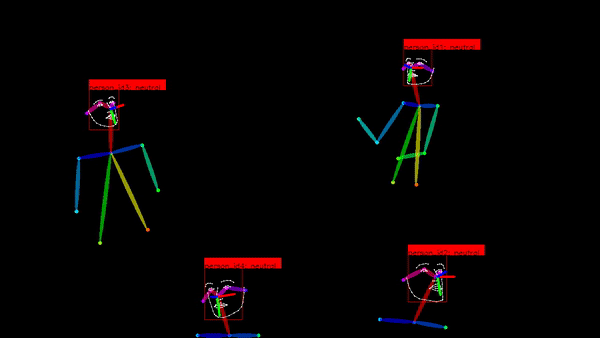
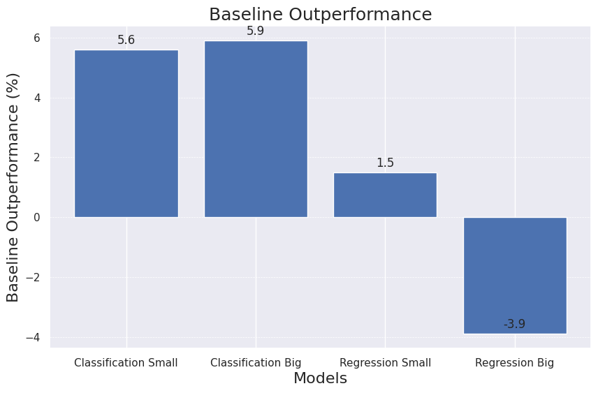

<!-- Improved compatibility of back to top link: See: https://github.com/othneildrew/Best-README-Template/pull/73 -->
<a name="readme-top"></a>
<!--
*** Thanks for checking out the Best-README-Template. If you have a suggestion
*** that would make this better, please fork the repo and create a pull request
*** or simply open an issue with the tag "enhancement".
*** Don't forget to give the project a star!
*** Thanks again! Now go create something AMAZING! :D
-->


<!-- PROJECT SHIELDS -->
<!--
*** I'm using markdown "reference style" links for readability.
*** Reference links are enclosed in brackets [ ] instead of parentheses ( ).
*** See the bottom of this document for the declaration of the reference variables
*** for contributors-url, forks-url, etc. This is an optional, concise syntax you may use.
*** https://www.markdownguide.org/basic-syntax/#reference-style-links
-->


<!-- PROJECT LOGO -->
<br />
<div align="center">
  <a href="https://github.com/othneildrew/Best-README-Template">
  </a>

  <h2 align="center">Automated Well-Being Prediction Toolkit: Facial Analysis System, Visual Feature Extraction, PERMA Prediction</h2>

  <p align="center">
    The main repository for my master thesis on "Prediciting Well-Being in Team Collaboration from Video Data Using Machine Learning"
  </p>

  <a href="https://github.com/mo12896/facial-analysis-system/blob/master/LICENSE">
    
  </a>
  <a href="https://www.linkedin.com/in/moritz-mueller-m7/">
      
  </a>
  <br />
  <br />
  
</div>

## Table of Contents
* [About The Project](#about-the-project)
* [Getting Started](#getting-started)
  * [Prerequisites](#prerequisites)
  * [Installation](#installation)
* [How to Use it](#how-to-use-it)
  * [Pre-Processing](#pre-processing-0)
  * [Analysis Pipeline](#analysis-pipeline-1-2-3)
  * [Data Visualization](#data-visualization)
* [Model Performances for PERMA Prediction](#model-performances-for-perma-prediction)
* [Known Issues](#known-issues)
* [License](#license)
* [Contact](#contact)


<!-- ABOUT THE PROJECT -->
## About The Project

This repository contains the work for my master's thesis, which investigates the prediction of individual well-being in team settings through video data. By harnessing AI tools, the project detects facial emotions, gaze and head motion patterns from 56 participants across multiple teamwork tasks. The aim is to modernize well-being prediction, traditionally done via surveys, providing more immediate and automatic feedback. We extract and analyze relevant features such as non-verbal cues from the video data, using state-of-the-art AI tools for face detection, tracking, re-identification, facial emotion recognition and head pose estimation for example. them to estimate well-being according to the PERMA framework. The generated features were used to predict the well-being of each team member using both regression and binary classification

For this study the PERMA (positive emotion, engagement, relationships, meaning, and accomplishment) framework by Seligman is employed, which is a metric that measures subjective well-being. The overall goal is to increase the well-being of individuals and teams by better understanding the factors that contribute to well-being in a team setting.

The best performing model for binary classification outperform a naive basline by 5.9% and for regression by 1.5% on the small feature dataset.

Feel free to explore the repository and ask any questions or share ideas. Your feedback and collaboration are always welcome. I am looking forward to sharing my research with you and making a positive impact in the field of team dynamics.

If you have any questions or ideas, please don't hesitate to get in touch. I am always open to feedback and suggestions.

<p align="right">(<a href="#readme-top">back to top</a>)</p>


<!-- GETTING STARTED -->
## Getting Started

To get a local copy up and running follow the following steps.

### Prerequisites

To harness the full power of CUDA GPU acceleration during inference, ensure that your machine is equipped with an NVIDIA Graphics Card (GPU).

### Installation

1. Clone the repo and the utilized submodules:
   ```sh
   git clone --recurse-submodules https://github.com/mo12896/facial-analysis-system.git
   ```
2. Go into working directory and create a virtual environment using conda:
    ```sh
    cd facial-analysis-system
    conda create -n facesys python=3.10.6
    conda activate facesys
    ```
    ... or create a virtual environment using venv:
    ```sh
    cd facial-analysis-system
    python3 -m venv facesys
    source facesys/bin/activate
    ```
3. Run the provided setup script to install all necessary dependencies:
   ```sh
   chmod +x setup.sh
   bash setup.sh
    ```

<p align="right">(<a href="#readme-top">back to top</a>)</p>


<!-- USAGE EXAMPLES -->
## How to Use it

Place the video file in the folder `data/input` and write the full `<video_name>`, e.g. `video.mp4` of the video file alongside the video format in the the config file `config/config.yaml` at the top. The video file must be in the correct format, i.e. .mp4 or .avi and contain video recordings of team collaboration. To enable the 3D gaze pattern estimation framework, the video must be captured with a 360° camera of j5create in the "two 180° images" mode.


### Pre-Processing [0]

Set the relevant parameters in the config file `config/config.yaml` in the `OFFLINE` part and run the following command, which starts the pre-processing script to generate the template embedding database for the relevant team members. The pre-processing step is optional and can be skipped if the database already exists. Different approaches to generate the template embeddings are imaginable and can be exchanged with the proposed approach. The following script runs the template generation process outlined in the master thesis and stores the face ID images and templates database under `data/output/<video_name>/utils/`. Note, that the first setup takes a while, since pretrained checkpoints for the deep learning models have to be downloaded!

```sh
python main.py --mode 0
```


### Analysis Pipeline [1, 2, 3]

Set the relevant parameters for the facial anylsis and the feature extraction/PERMA predictionin the config file `config/config.yaml` in the `ONLINE` part. The pipeline can be used in three main steps, which can be run in sequences of different length. Each downstream step depends on the previous step and can only be executed when its predecessor has been executed at least once. The steps can each be run seperately - if the previous steps have already been run - or directly in sequences, i.e. one of these combinations: ["0", "1", "2", "3", "01", "012", "0123", "12", "23", "123"], where 0 is the preprocessing step. The single steps are defined as follows:

1. **Facial Analysis [1]**: Extracts facial features from a .mp4 or .avi video file. The extracted features are stored in the folder `data/output/<video_name>/analysis_results/`:
   - CSV file: The CSV-file contains the facial features of each frame in the video file.
   - MP4 file (optionally): The MP4 file can be generated optionally and contains the video with the extracted facial features for visual verficiation. Can be invoked by setting the `-o` flag in the command.
2. **Feature Extraction [2]**: Extracts features from the facial features stored in the database. The extracted features are stored in the folder `data/output/<video_name>/extraction_results/`.
    - CSV file: The CSV-file contains the final features of each team member, visible in the video file. The feature can be extracted using the handcrafted approach for generating a small dataset and/or the brute force approach for generating a big dataset.
    - PNG files (optionally): The PNG files can be generated optionally, when running streamlit for data visualization and contain some of the extracted features for visual verficiation.
3. **PERMA Prediction [3]**: Predicts the PERMA score of each team member based on the extracted features. The final predictions are stored in the folder `data/output/<video_name>/prediction_results/`.
    - CSV file: The CSV-file contains the predicted PERMA score of each team member.
    - PNG files: The PNG files can be generated optionally and contains the predicted PERMA scores as radar plots (regression) or bar plots (binary classification) for visual verificiation.

As an exmaple, running all three analysis steps [1, 2, 3] in sequence (assuming that 0 has already been executed) can be done by running the following command:

```sh
python main.py --mode 123
```

### Data Visualization

After running all pipeline steps, the resulting features and perma prediction plots can be rendered unified using a streamlit dashboard by simply providing the `-d` flag in the command. By running this command, the script will automatically generate the feature visualizations as PNG-files into the `data/output/<video_name>/extraction_results/` folder and fetch the generated PERMA prediction PNG files from `data/output/<video_name>/prediction_results/`. Both sources will be rendered in the streamlit app. Note, that the flag can also be combined with running the full pipeline.

```sh
python main.py -d
```


<p align="right">(<a href="#readme-top">back to top</a>)</p>


## Model Performances for PERMA Prediction

This study outlines two approaches to PERMA prediction: binary classification and regression. Both types of approaches have been evaluated on two different feature sets: a small feature set and a big feature set. The small feature set contains 125 features in total, while the big feature set contains 9,341 features. The following table shows the performance of the different approaches compared to a task-specific baseline on the test set. The models are evaluated using the mean absolute error (MAE) and the balanced accuracy score (ACC) for regression and binary classification, respectively.

**Binary Classification Models**: These models categorize PERMA scores into 'high' or 'low'. The 'Small' model outperforms the baseline by 5.6%, while the 'Big' model does so by 5.9%. Ideal for high-level PERMA categorizations.

**Regression Models**: These models provide a detailed PERMA score between 1 and 7. The 'Small' model outperforms the baseline by 1.5%, while the 'Big' model underperforms by -3.9%. Suitable for granular PERMA estimations.


<div align="center">
  
</div>


## Known Issues

- If there are problems with the setup.sh script, conduct the steps manually.Specifically the download of the data sometimes fails. For this, refer to the Synergy [README](https://github.com/choyingw/SynergyNet), where all steps and download links are provided.
- The feature_vector.py script might generate less than 776 features per time series for shorter videos. This is known and is due to the script automatically filtering columns with NaN values. By providing longer videos, the problem should be resolved.
- The same issue account for the mutual gaze matrix, which might not be rendered in streamlit for shorter videos.
- Currently, the verification video in the facial analysis step can only be invoked with the single step, like this `python main.py --mode 1 -o`, and not with the full pipeline, like this `python main.py --mode 123 -o`. This will be fixed in the future.


<!-- LICENSE -->
## License

Distributed under the MIT License. See `LICENSE` for more information.

<p align="right">(<a href="#readme-top">back to top</a>)</p>


<!-- CONTACT -->
## Contact
Should you come across any problems, feel free to contact me or initiate a new issue in this repo.

Moritz Müller - moritz1996.mueller@gmail.com

Project Link: [Facial Analysis System](https://github.com/mo12896/facial-analysis-system)

<p align="right">(<a href="#readme-top">back to top</a>)</p>


